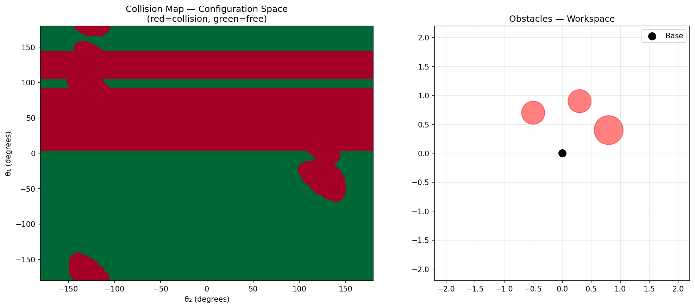

# GPU-Accelerated Policy Inference & Motion Planning


Profiling and optimizing a robot manipulation policy inference loop on NVIDIA T4,
from Python-level analysis down to custom CUDA and Triton kernels — with a
GPU-accelerated motion planner for a 2-link robot arm.

Built as a portfolio project targeting ML systems and inference optimization roles.

---


## Results

| Experiment | Detail | Result |
|---|---|---|
| Roofline analysis | BC policy on RoboMimic Lift task | AI = 0.234 FLOP/byte — memory-bound |
| torch.compile | `reduce-overhead` mode vs eager | **11.8x** latency reduction (2.13ms → 0.18ms) |
| Naive CUDA matmul | Hand-written vs cuBLAS | 317 GFLOP/s — 7.2x behind cuBLAS |
| Tiled CUDA matmul | 16×16 shared memory tiling | 457 GFLOP/s — 1.44x over naive |
| Triton flash-attention | vs PyTorch native SDPA | **1.71x** speedup, numerically exact |
| GPU collision map | 1M configurations, 2-link arm | **23.6x** over CPU (2.79ms vs 65.85ms) |

<p align="center">
  
</p>

<p align="center">
  
</p>

---

## Stack

PyTorch · CUDA C++ · Triton · RoboMimic · NVIDIA T4 · Python

---

## Dataset

Uses the RoboMimic Lift task dataset (mixed human demonstrations).

```bash
pip install robomimic
python -m robomimic.scripts.download_datasets \
    --tasks lift \
    --dataset_types mh \
    --download_dir ./data
```

---

## Key Findings

**1. The inference loop is memory-bound.**
Profiling the BC policy forward pass with `torch.profiler` shows `aten::addmm`
dominates at 92% of CUDA time. Arithmetic intensity is 0.234 FLOP/byte —
115x below the T4's FP32 ridge point of 27 FLOP/byte.

**2. torch.compile recovers dispatch overhead, not arithmetic cost.**
The 11.8x speedup from `torch.compile` comes from eliminating Python kernel
launch overhead, not improving arithmetic efficiency. Compiled latency (0.18ms)
matches raw CUDA kernel time from the profiler (0.164ms) — confirming near-zero
overhead in compiled mode.

**3. Tiling improves memory reuse but cuBLAS gap remains large.**
Shared memory tiling reduces redundant DRAM reads, giving 1.44x over naive.
The 5x gap to cuBLAS reflects architecture-specific optimizations (larger tiles,
vectorized loads, warp-level primitives) that hand-written kernels don't capture
at this scale.

**4. GPU parallelism scales with problem size.**
The collision checker shows 1.31x speedup at 2,500 configurations scaling to
23.6x at 1,000,000 — demonstrating that GPU advantage is problem-size dependent
and most valuable for dense planning workloads.

---

## Motivation

This project grew out of real work running VLA/VLM inference on robot manipulation
demonstrations. The profiling methodology and optimization techniques here directly
address bottlenecks encountered in production teleoperation pipelines.
